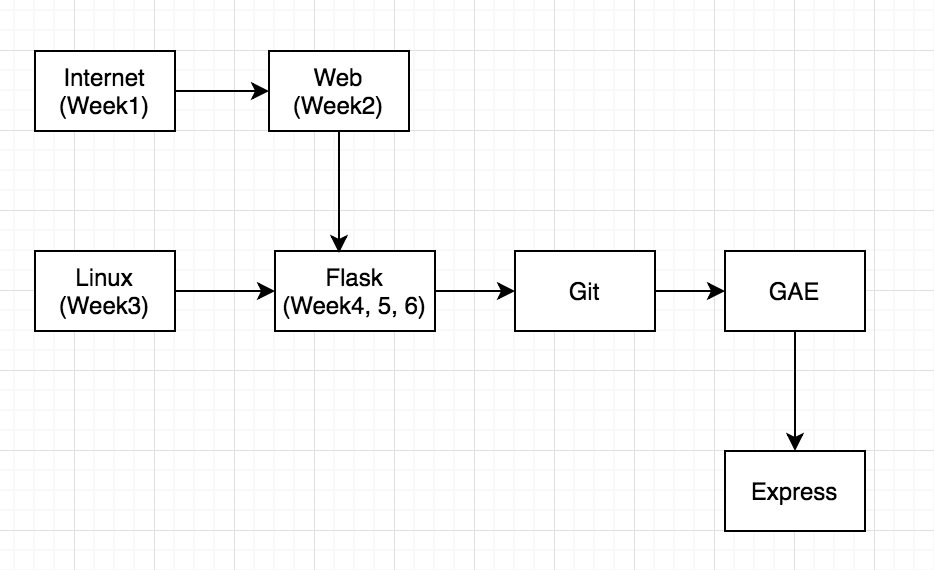
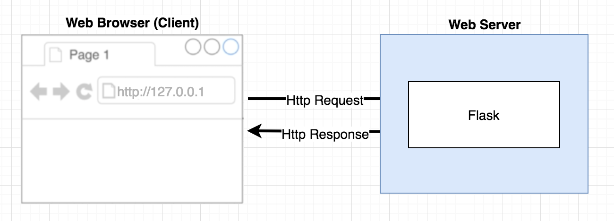
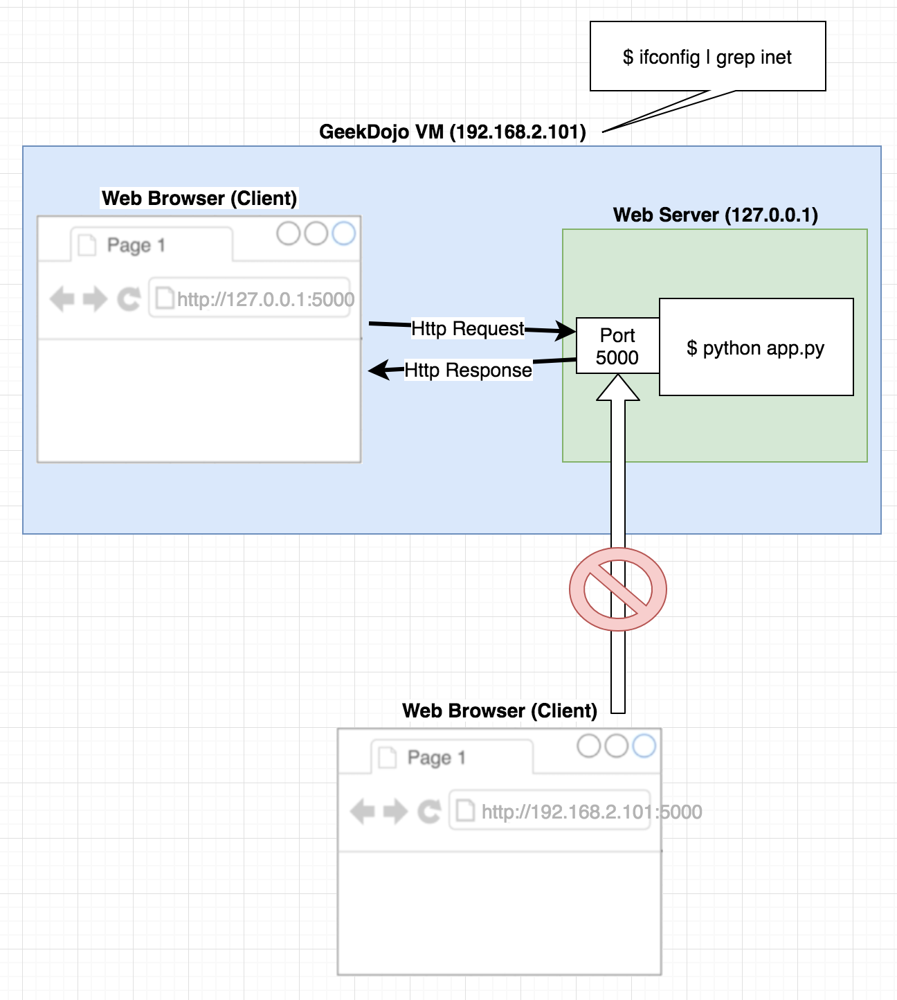
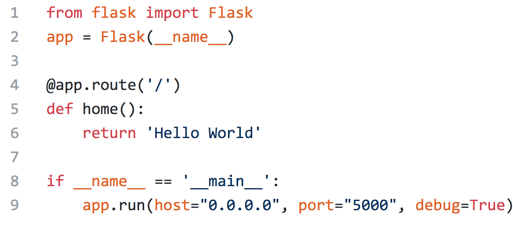
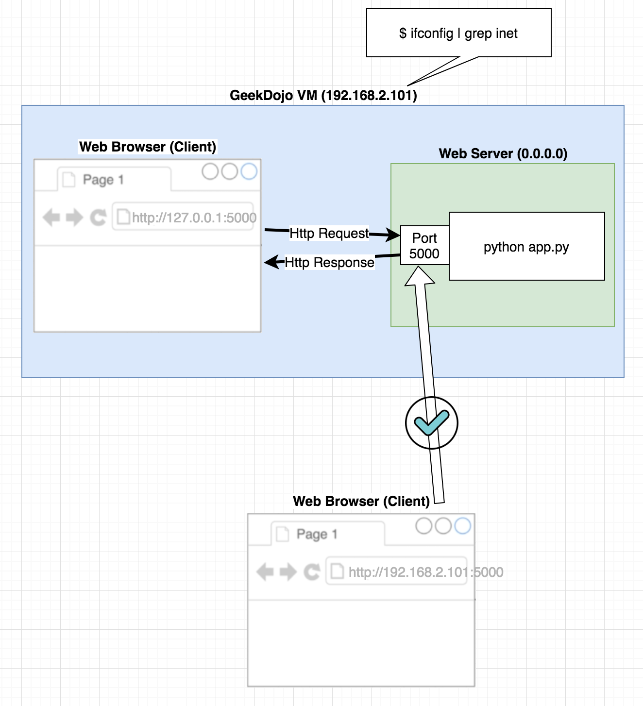
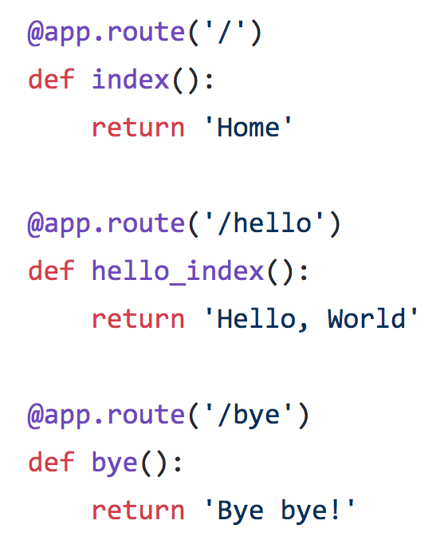
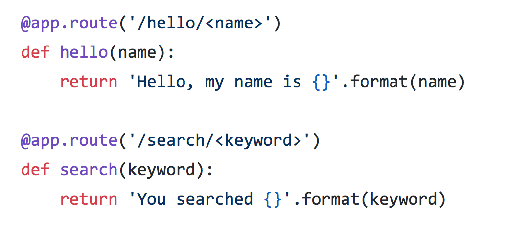

# Web Programming Course

## Curriculum
At high-level, this course follows the following curriculum: 
1. Learn how computer network, Internet and World Wide Web work.
2. Learn Linux and use it in VirtualBox
3. Learn the Python Flask programming
4. Learn Git and GitHub
5. Use Google App Engine (GAE) to deploy your code to Internet
6. Learn Node.js / Express


*High-level overview of this course*

---

## Week 1 - Introduction to Network & History of Internet

- Homework: Write a research paper about what happens when you type an URL (example: www.google.com) in a web browser and press enter.

---

## Week 2 - Introduction to Network & History of Internet (Cont.)

- Homework: Write a research paper on an IP address. Topics should cover:
    - What is IP address (IPv4)?
    - What is subnetting?
    - What are private addresses?
    - What is a dynamic IP address?
    - What is port 53 used for?

---

## Week 3 & Week 4 - Python / Flask Programming with Http Request and Response

### Linux commands
#### Brief list of linux commands
| Command  | Description  | Example |
|---|---|---|
| `mkdir`  | Make directory   | `$ mkdir py_hello` |
| `pwd`    | Display the current directory | `$ pwd` |
| `ls`     | List files in the current directory | `$ ls` |
| `cd`     | Create a directory | `$ cd home` |
| `touch`  | Create an empty file if it doesn't exist. | `$ touch hello.py` |

---

### Examples of CD (Change Directory)
Go to a home directory
```
$ cd ~ 
```

Go to the SourceControl directory
```
$ cd SourceControl 
```
Move up to a parent directory (..)
```
$ cd .. 
```

Go to the root directory (/)
```
$ cd / 
``` 


#### Quiz

- Open Terminal. Create `linux_quiz` directory under the `SourceControl` directory, and create a sub directory `subdir1`, `subdir2` and `subdir3` under `linux_quiz` directory. Create `hello.txt` under `subdir2` directory. Create `README.md` under `subdir3` directory. Once all directories and files are created, type `ls -R` and press <kbd>enter</kbd> to verify the result. Here is an example of the expected behavior:
```console
$ ls -R
.:
subdir1  subdir2  subdir3

./subdir1:

./subdir2:
hello.txt

./subdir3:
README.md

```

---

### Flask Web Server
Flask is a simple yet powerful Python web server.



### 'Hello World' project
Open the Terminal.
Verify that you are on the home directory.

```console
$ pwd
```

Go to the SourceControl directory.

```console
$ cd SourceControl
```
Create a new project directory, 'py_hello'.

```console
$ mkdir py_hello
```

Go to the py_hello directory.

```console
$ cd py_hello
```

Install Flask.

```console
$ pip install flask --user
```

Create 'app.py' file.

```console
$ touch app.py.
```

Launch the Visual Studio Code.

```console
$ code .
```

Type the following lines of code in the app.py using the Visual Studio Code editor.


From the Terminal, run $`python app.py`.

```console
$ python app.py
```

Then, open a web browser from the VM, and type `http://127.0.0.1:5000` to verify that your program is working.

Find the IP address for your VM using the following command:

```console
$ ifconfig | grep inet
```

Then, from your host (Windows), open a web browser, and type the address (Example: `http://192.168.2.101:5000`), and verify that you cannot access the app. This is because the app only allows the local connection. This diagram illustrates that:


From the Terminal, press <kbd>Ctrl+C</kbd> to kill the app.

#### Quiz

- Create `flask_quiz1` directory under the `SourceControl` directory, and create a Flask app that returns your name. Verify that it works.

### 'Hello World' project (Part 2)

To allows the access outside your VM and debugging, change Line 9 to the following:

```python
app.run(host="0.0.0.0", port="5000", debug=True)
```

So, the changed code should look like this:



From the Terminal, run $`python app.py`.

```console
$ python app.py
```

Then, open a web browser from the VM, and type `http://127.0.0.1:5000` to verify that your program is working.

From your host (Windows), open a web browser, and type the address (Example: `http://192.168.2.101:5000`), and verify that you can access the app. This diagram illustrates that:


From the Terminal, press <kbd>Ctrl+C</kbd> to kill the app.


#### Quiz

- Create `flask_quiz2` directory under the `SourceControl` directory, and create a Flask app that returns your name. Access the website from your Windows machine. Verify that it works.

---


### Routing
Use `@app.route()` to bind a function to a specific URL path.

#### Basic routing




#### Quiz

- Create `flask_quiz3` directory under the `SourceControl` directory, and copy the code inside app.py from [003_py_counter](003_py_counter/) example. Add `/reset` path which binds to a `reset()` method which resets the counter to `0`.

#### Dynamic routing
You can make the URL path dynamic by accepting a `<name>`, and pass the `name` variable as an input parameter to the method bound to the route. Here is an example:


#### Quiz
- Enhance the `flask_quiz3` by creating a path `/set/<new_counter>` which binds to a `set(new_counter)` method which sets the counter to the `new_counter` variable if the `new_counter` is an unsigned integer (non-negative integer).

### Templates
Key points of templates

- Create a html file inside the `templates` folder.
- Use `{{ variables }}` syntax inside an html file.
- Use `` syntax inside an html file for conditional and loop statements.
- Use `url_for(endpoint)` method to link to each endpoint.

---

#### Pet-Rescue Project (Part 1)

Open the Terminal.
Verify that you are on the home directory.

```console
$ pwd
```

Go to the SourceControl directory.

```console
$ cd SourceControl
```
Create a new project directory, 'py_hello'.

```console
$ mkdir py_templates
```

Go to the py_templates directory.

```console
$ cd py_templates
```

Install Flask.

```console
$ pip install flask --user
```

Create 'app.py' file.

```console
$ touch app.py
```


Create 'templates' folder.

```console
$ mkdir templates
```

Launch the Visual Studio Code.

```console
$ code .
```
Create `home.html` file inside the `templates folder, and type the following lines of code using the Visual Studio Code editor.

```html
<html>
<head>
    <title>{{title}}</title>
</head>
<body>
    <H3>{{title}}</H3>
</body>
</html>
```


Type the following lines of code in the app.py using the Visual Studio Code editor.

```python
from flask import Flask, render_template

app = Flask(__name__)

@app.route('/')
def home():    
    return render_template('home.html', title='Welcome to Pet Rescue')

if __name__ == '__main__':
    app.run(debug=True)

```


From the Terminal, run $`python app.py`.

```console
$ python app.py
```

#### Pet-Rescue Project (Part 2)

Let's continue the part 2 by creating a page for puppies.

Create `puppies.html` file inside the `templates folder, and type the following lines of code using the Visual Studio Code editor.

```html
<html>
<head>
    <title>{{title}}</title>
</head>
<body>
    <h3>{{title}}</h3>
    <div>{{subtitle}</div>
    <ul>
        
        <li>{{ puppy }}</li>
        
    </ul>    
</body>

</html>
```

Type the following lines of code above the `if __name__ == '__main__':` line in the app.py using the Visual Studio Code editor.

```python

@app.route('/puppies')
def puppies():
    puppies = ['Rufus', 'Corgies', 'Golden Retrievers', 'Beagle', 'Poodle', 'Pug']
    return render_template('puppies.html', 
    title='Puppies', 
    subtitle='Bring these puppies to your home!'
    puppies=puppies)

```

So, the complete code for the app.py should look like this:

```python

from flask import Flask, render_template

app = Flask(__name__)

@app.route('/')
def home():    
    return render_template('home.html', title='Welcome to Pet Rescue')

@app.route('/puppies')
def puppies():
    puppies = ['Rufus', 'Corgies', 'Golden Retrievers', 'Beagle', 'Poodle', 'Pug']
    return render_template('puppies.html', 
    title='Puppies', 
    subtitle='Bring these puppies to your home!'
    puppies=puppies)

if __name__ == '__main__':
    app.run(debug=True)

```

From the Terminal, run $`python app.py`.

```console
$ python app.py
```

#### Practice
1. Create a route for cats by creating the `kittens.html` and provide the title, subtitle variables as well as the kittens list from the app.py. Display the title, subtitle and the kittens list inside the kittens.html.

2. Create a route for birds by creating the `birds.html` and provide the title, subtitle variables as well as the birds list from the app.py. Display the title, subtitle and the birds list inside the birds.html.


#### Pet-Rescue Project (Part 3)
Let's add links from the home page to the puppies, kittens and birds page using `url_for(endpoint)` method. Verify that the urls are working by running `python app.py` from the Terminal.

```html
<html>
<head>
    <title>{{title}}</title>
</head>
<body>
    <H3>{{title}}</H3>
    <div>
        <h2>
            
                <a href="{{url_for(pet["url"])}}">pet["title"]</a>
            
        </h2>
    </div>
</body>
</html>

```

Let's add the "Home" link on the puppies page by adding the following line right below the `<body>` tag so that users can go back to the home page.

```html
<h3><a href="{{ url_for('home') }}">Home</a></h3>
```

So, the final code for the puppies should look like below:

```html
<html>
<head>
    <title>{{title}}</title>
</head>
<body>
    <h3><a href="{{ url_for('home') }}">Home</a></h3>
    <h3>{{title}}</h3>
    We have lots of puppies...
    <ul>
        
        <li>{{ puppy }}</li>
        
    </ul>
</body>

</html>

```

#### Practice
1. Add the "home" link on the cats page just like the above example on Part 3.
2. Add the "home" link on the birds page just like the above example on Part 3.


## GIT & GitHub
Git is a source code management system that keeps track of changes of any set of files.

GitHub is a widely popular free service (paid service also available) for Git.

### Step 1: Creating a GitHub account
- Go to https://github.com/, click _Sign up_ and complete the registration process.

### Step 2: Creating a new Repository
1. Go to https://github.com, and sign in if you are not already signed in.
2. Click _New Repository_ button or go to https://github.com/new. 
    
    2.1 Type the name of repository, i.e. _HackerRank_
    
    2.2 For _Add .gitignore_, choose Python.
    
    2.3 Click _Create Repository_

### Step 3: Clone the Git Repository
1. Go to the newly created repository in Step 2
2. Click _Clone or download_ button, and copy the address of the Git.
3. From your Linux VM, open Terminal.
4. Type the following command.
```console
$ git clone <git_repository_url>
```

### Step 4: Add a New File

1. Create a new file, README.md from Terminal.
```console
$ touch README.md
```
2. Open Visual Studio Code
```console
$ code .
```
3. Add contents to README.md.
4. From Terminal, add the change to Git.
```console
$ git add .
```
5. Then, commit the change to Git.
```console
$ git commit -m "Add README.md"
```
6. Then, push the change to GitHub.
```console
$ git push
```
At this point, the change you made has been pushed to GitHub. Let's open a web browser, go to https://www.github.com, navigate to your Git repository to verify that your change is in the Git repository.

From now, I will call Git repo instead of Git repository.

#### Practice
1. Open Terminal. Create `hello_world.py`, and write a code that prints "Hello, World!". Publish(Push) the `hello_world.py` to your Git repo.
2. Instead of solving a HackerRank problem (I'll provide you the question) from a web browser, create `hackerrank_problem.py`, and solve the problem using Visual Studio Code. Verify that the code is working. Copy and paste the code to HackerRank to verify that your solution is working. Then, push the change to your Git Repo.


## Python App Examples

| Code  | Type | Examples  | 
|---|---|---|
|[000_py_google](000_py_google/) | Client | Build a simple client to get HTML from a web site |
|[001_py_slack](001_py_slack/) | Client | Build a slack client to post a message in a Slack |
| [002_py_hello](002_py_hello/) | Server | Build a simple web application that displays 'Hello World' using `Flask` |
| [003_py_counter](003_py_counter/) | Server | Build a simple counter web application using `Flask` |
| [004_py_routes](004_py_routes/) | Server | Build a web app with multiple routes |
| [005_py_requirements](005_py_requirements/) | Server | Use Requirements.txt for dependencty management |
| [006_py_templates](006_py_templates/) | Server | Build a pet-rescue web site using Flask and Jinja2 templates |
