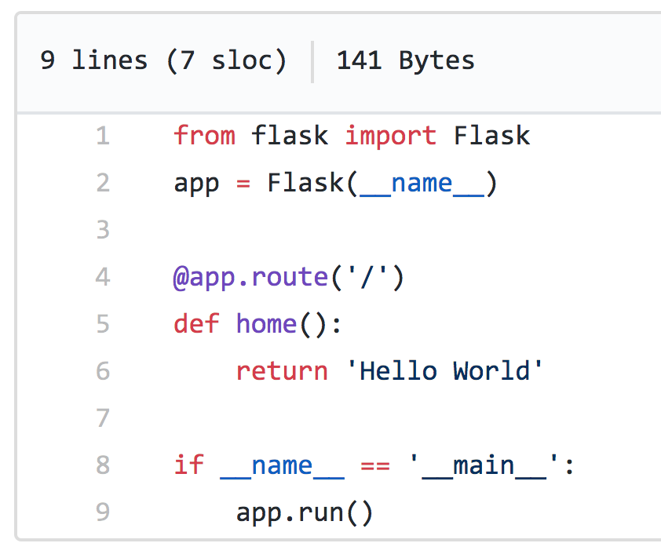

# Web Programming Course

## Curriculum
At high-level, this course follows the following curriculum: 
1. Learn how computer network, Internet and World Wide Web work.
2. Learn Linux and use it in VirtualBox
3. Learn the Python Flask programming
4. Learn Git and GitHub
5. Use Google App Engine (GAE) to deploy your code to Internet
6. Learn Node.js / Express


*High-level overview of this course*

---

## Week 1 - Introduction to Network & History of Internet

- Homework: Write a research paper about what happens when you type an URL (example: www.google.com) in a web browser and press enter.

---

### Week 2 - Introduction to Network & History of Internet (Cont.)

- Homework: Write a research paper on an IP address. Topics should cover:
    - What is IP address (IPv4)?
    - What is subnetting?
    - What are private addresses?
    - What is a dynamic IP address?
    - What is port 53 used for?

### Week 3 & Week 4 - Python / Flask Programming with Http Request and Response

##### Linux commands
###### Brief list of linux commands
| Command  | Description  | Example |
|---|---|---|
| `mkdir`  | Make directory   | `$ mkdir py_hello` |
| `pwd`    | Display the current directory | `$ pwd` |
| `ls`     | List files in the current directory | `$ ls` |
| `cd`     | Create a directory | `$ cd home` |
| `touch`  | Create an empty file if it doesn't exist. | `$ touch hello.py` |

###### Examples of CD (Change Directory)
Go to a home directory
```
$ cd ~ 
```

Go to the SourceControl directory
```
$ cd SourceControl 
```
Move up to a parent directory (..)
```
$ cd .. 
```

Go to the root directory (/)
```
$ cd / 
``` 


###### Examples of Creating the 'Hello World' project
Open the Terminal.
Verify that you are on the home directory.
```
$ pwd
```
Go to the SourceControl directory.
```
$ cd SourceControl
```
Create a new project directory, 'py_hello'.
```
$ mkdir py_hello
```
Go to the py_hello directory.
```
$ cd py_hello
```
Install Flask.
```
$ pip install flask --user
```
Create 'app.py' file.
```
$ touch app.py.
```
Launch the Visual Studio Code.
```
$ code .
```

Type the following lines of code in the app.py using the Visual Studio Code editor.

*app.py for Hello World*

From the Terminal, run $`python app.py`.
```
$ python app.py
```

Then, open a web browser from the VM, and type `http://127.0.0.1:5000` to verify that your program is working.

---

## Python App Examples

| Code  | Type | Examples  | 
|---|---|---|
|[000_py_google](000_py_google/) | Client | Build a simple client to get HTML from a web site |
|[001_py_slack](001_py_slack/) | Client | Build a slack client to post a message in a Slack |
| [002_py_hello](002_py_hello/) | Server | Build a simple web application that displays 'Hello World' using `Flask` |
| [003_py_counter](003_py_counter/) | Server | Build a simple counter web application using `Flask` |
| [004_py_routes](004_py_routes/) | Server | Build a web app with multiple routes |
| [005_py_requirements](005_py_requirements/) | Server | Use Requirements.txt for dependencty management |